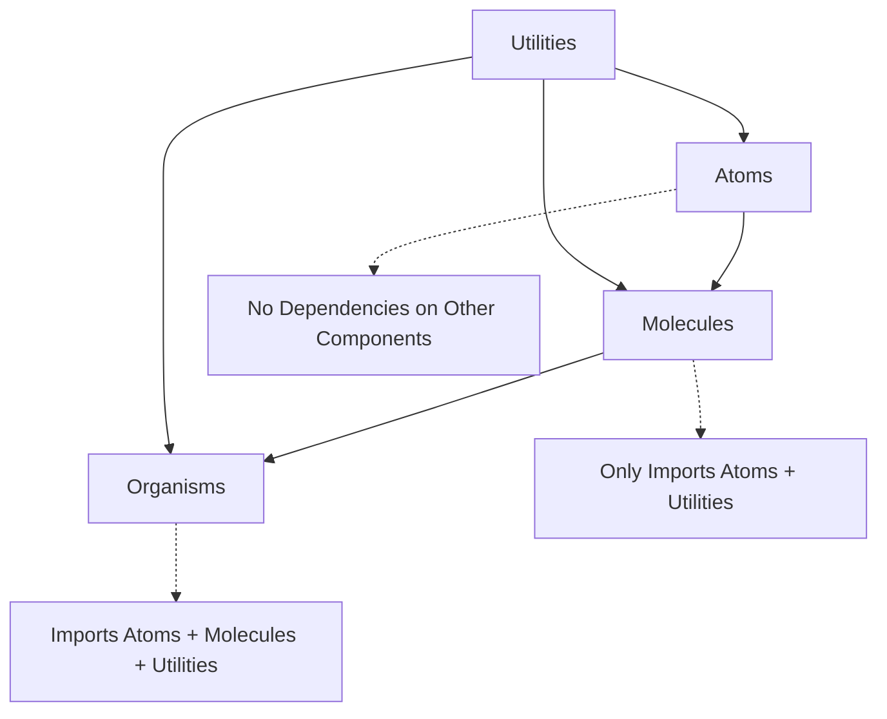

# Contributing to MaterialLab Design System

Welcome to the MaterialLab design system! This guide will help you contribute effectively while maintaining our atomic design principles and ensuring consistency across the codebase.

## 🎯 Design System Philosophy

MaterialLab follows **Atomic Design Methodology** with two complementary design philosophies:
- **Humanistic Intelligence**: Warm, approachable AI-human collaboration
- **Structured Dynamism**: Technical precision and systematic efficiency

All contributions must support both themes and maintain strict atomic hierarchy.

## 🏗️ Atomic Design Hierarchy



### **Import Rules (Strictly Enforced)**
- ✅ **Atoms**: Can only import utilities and other atoms
- ✅ **Molecules**: Can import atoms and utilities  
- ✅ **Organisms**: Can import atoms, molecules, and utilities
- ❌ **Never**: Atoms importing molecules, molecules importing organisms

## 🚀 Getting Started

### **Prerequisites**
```bash
node >= 18.0.0
npm >= 9.0.0
```

### **Development Setup**
```bash
# Clone repository
git clone https://github.com/materiallab/materiallab-website.git
cd materiallab-website

# Install dependencies
npm install

# Start development server
npm run dev

# Run validation suite
npm run validate:all
```

### **Development Commands**
```bash
# Core development
npm run dev              # Start development server
npm run build           # Production build
npm run lint            # ESLint validation
npm run lint:fix        # Auto-fix lint issues

# Design system validation
npm run validate:tokens      # Check design token usage
npm run validate:atomic      # Verify atomic structure
npm run validate:themes      # Test theme support
npm run validate:all        # Full validation suite

# Component tools
npm run atomic:create       # Create new component
npm run atomic:migrate      # Migrate existing component
npm run atomic:registry     # Update component registry

# Testing
npm run test               # Run all tests
npm run test:visual        # Visual regression tests
npm run test:accessibility # A11y compliance tests
```

## 📋 Contribution Workflow

### **1. Before You Start**
- [ ] Check existing issues and discussions
- [ ] Review the [Component Registry](./COMPONENT_REGISTRY.md)
- [ ] Understand the [Migration Guide](./MIGRATION_GUIDE.md)
- [ ] Read relevant atomic README ([Atoms](./src/components/atoms/README.md), [Molecules](./src/components/molecules/README.md), [Organisms](./src/components/organisms/README.md))

### **2. Development Process**

#### **Creating New Components**
```bash
# Use the component generator
npm run atomic:create

# Follow prompts:
# - Component name (PascalCase)
# - Atomic level (atom/molecule/organism)
# - Initial props and variants
```

#### **Manual Component Creation**
1. **Create component directory:**
   ```
   src/components/{atoms|molecules|organisms}/ComponentName/
   ├── ComponentName.tsx
   ├── ComponentName.stories.tsx  
   ├── ComponentName.test.tsx
   └── index.ts
   ```

2. **Follow the atomic template:**
   - Use templates from atomic README files
   - Implement design token usage
   - Add proper TypeScript interfaces
   - Include accessibility attributes

3. **Add to index files:**
   ```typescript
   // Add to src/components/{level}/index.ts
   export { ComponentName } from './ComponentName';
   ```

#### **Migrating Existing Components**
```bash
# Use migration helper
npm run atomic:migrate ComponentName

# Follow migration guide steps:
# 1. Identify atomic level
# 2. Extract dependencies  
# 3. Apply design tokens
# 4. Add theme support
# 5. Update tests and stories
```

### **3. Code Standards**

#### **Design Token Usage**
```typescript
// ✅ Correct - Using design tokens
const StyledButton = styled.button`
  background-color: var(--color-interactive-primary);
  color: var(--color-text-on-interactive);
  padding: var(--spacing-3) var(--spacing-6);
  border-radius: var(--radius-md);
  font-size: var(--text-base);
`;

// ❌ Incorrect - Hardcoded values
const StyledButton = styled.button`
  background-color: #FF6F61;
  color: white;
  padding: 12px 24px;
  border-radius: 8px;
  font-size: 16px;
`;
```

#### **Theme Support**
```typescript
// All components must work with both themes
[data-theme="humanistic-light"] & { /* styles */ }
[data-theme="humanistic-dark"] & { /* styles */ }
[data-theme="structured-light"] & { /* styles */ }
[data-theme="structured-dark"] & { /* styles */ }
```

#### **TypeScript Requirements**
```typescript
// Comprehensive interfaces with JSDoc
export interface ComponentProps {
  /** Visual variant of the component */
  variant?: 'primary' | 'secondary';
  
  /** Size of the component */
  size?: 'sm' | 'md' | 'lg';
  
  /** Whether the component is disabled */
  disabled?: boolean;
  
  /** Callback fired on interaction */
  onClick?: (event: MouseEvent) => void;
}

// Runtime validation in development
if (process.env.NODE_ENV === 'development') {
  Component.propTypes = createAtomValidator('Component');
}
```

#### **Accessibility Requirements**
```typescript
// Proper ARIA implementation
<Component
  role="button"
  aria-label="Close dialog"
  aria-pressed={isPressed}
  tabIndex={disabled ? -1 : 0}
  onKeyDown={handleKeyDown}
>
  Content
</Component>
```

### **4. Testing Requirements**

#### **Unit Tests**
```typescript
describe('Component', () => {
  test('renders with correct props', () => {
    render(<Component variant="primary" />);
    expect(screen.getByRole('button')).toHaveClass('variant-primary');
  });
  
  test('handles user interaction', async () => {
    const user = userEvent.setup();
    const mockClick = jest.fn();
    
    render(<Component onClick={mockClick} />);
    await user.click(screen.getByRole('button'));
    
    expect(mockClick).toHaveBeenCalled();
  });
  
  test('supports all theme variants', () => {
    const themes = ['humanistic-light', 'structured-dark'];
    
    themes.forEach(theme => {
      render(
        <div data-theme={theme}>
          <Component />
        </div>
      );
      // Verify styling
    });
  });
});
```

#### **Storybook Documentation**
```typescript
export default {
  title: 'Atoms/Component',
  component: Component,
  parameters: {
    docs: {
      description: {
        component: 'Clear description of component purpose and usage.'
      }
    }
  }
} satisfies Meta<typeof Component>;

export const AllVariants: Story = {
  render: () => (
    <div>
      <Component variant="primary">Primary</Component>
      <Component variant="secondary">Secondary</Component>
    </div>
  )
};
```

### **5. Validation & Review**

#### **Pre-commit Validation**
All changes automatically run:
- ESLint with atomic design rules
- Design token validation
- TypeScript compilation
- Accessibility checks

#### **Pull Request Requirements**
- [ ] Use appropriate PR template (atomic_design_component.md or general.md)
- [ ] All automated checks pass
- [ ] Manual testing in all themes completed
- [ ] Component registry updated
- [ ] Documentation updated

#### **Review Process**
1. **Automated validation** (must pass)
2. **Code review** (maintainer approval)
3. **Design review** (for visual components)
4. **Accessibility review** (for interactive components)

## 🔧 Component Categories

### **High Priority Components Needed**
1. **FormField** (Molecule) - Input + Label + Validation
2. **SearchBox** (Molecule) - Input + Icon + Clear button  
3. **NavItem** (Molecule) - Navigation link with states
4. **Icon** (Atom) - SVG icon system
5. **Header** (Organism) - Site header with navigation

### **Migration Priority**
1. **ContactForm** - Non-compliant, high usage
2. **Navigation** - Mixed styles, site-wide impact
3. **ServiceCards** - Key conversion component

## 🎨 Design Resources

- **Design Tokens**: [design-system/01_tokens.json](./design-system/01_tokens.json)
- **Theme System**: [THEME_SYSTEM.md](./THEME_SYSTEM.md)  
- **Component Registry**: [COMPONENT_REGISTRY.md](./COMPONENT_REGISTRY.md)
- **Migration Guide**: [MIGRATION_GUIDE.md](./MIGRATION_GUIDE.md)
- **Validation Rules**: [VALIDATION_RULES.md](./VALIDATION_RULES.md)

## 🐛 Reporting Issues

### **Component Issues**
Use the atomic design component issue template:
- Component name and atomic level
- Expected vs. actual behavior
- Theme variants affected
- Steps to reproduce

### **Design Token Issues**
- Token name and current value
- Expected value or behavior
- Components affected
- Theme context

### **Accessibility Issues**
- Component name
- WCAG violation description
- Screen reader output (if applicable)
- Keyboard navigation issues

## 📖 Learning Resources

### **Atomic Design**
- [Atomic Design Methodology](http://atomicdesign.bradfrost.com/)
- [Component-Driven Development](https://www.componentdriven.org/)

### **Accessibility**
- [WCAG 2.1 Guidelines](https://www.w3.org/WAI/WCAG21/quickref/)
- [WAI-ARIA Authoring Practices](https://www.w3.org/WAI/ARIA/apg/)

### **Design Tokens**
- [Design Tokens W3C Spec](https://www.w3.org/community/design-tokens/)
- [Token Naming Conventions](https://medium.com/eightshapes-llc/naming-tokens-in-design-systems-9e86c7444676)

## ❓ Getting Help

- **Design System Questions**: Create discussion in GitHub
- **Bug Reports**: Use issue templates  
- **Feature Requests**: Create feature request issue
- **General Questions**: Check existing documentation first

## 🏆 Recognition

Contributors who consistently follow atomic design principles and help maintain system quality will be recognized in our contributors list and may be invited to join the design system maintainers team.

---

**Last Updated:** January 2025  
**Version:** 1.0.0  
**Maintainers:** MaterialLab Team