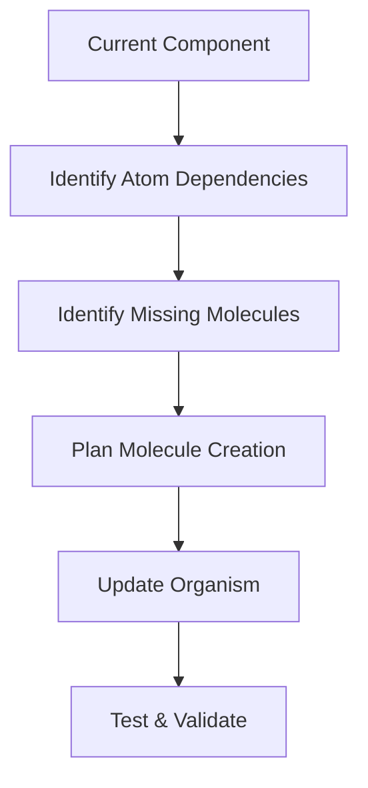

# Component Migration Guide

This guide provides step-by-step instructions for migrating existing components to the MaterialLab atomic design system and ensuring full compliance with design tokens and theme support.

## Migration Overview

### **Current State Analysis**
Based on the Component Registry, components fall into three categories:

#### ✅ **Compliant Components** (No migration needed)
- `src/components/UI/Button.tsx`
- `src/components/UI/Input.tsx`
- `src/components/ML/Typography.tsx`

#### ⚠️ **Partially Compliant** (Minor updates needed)
- `src/components/ML/Card.tsx`
- `src/components/Navigation/Navigation.tsx`
- `src/components/VeoHero.tsx`

#### ❌ **Non-Compliant** (Full migration required)
- `src/components/ContactForm/ContactForm.tsx`
- `src/components/ServiceCards/ServiceCards.tsx`
- `src/components/MediaPlaceholder/MediaPlaceholder.tsx`

## Migration Priority Matrix

### **Phase 1: High Priority** (Immediate)
Components affecting core user journeys and site-wide experience.

#### 1. ContactForm → FormField Molecules + ContactForm Organism
**Impact**: High | **Effort**: Medium | **Timeline**: 1-2 days

**Current Issues**:
```typescript
// ❌ Current implementation
const StyledForm = styled.form`
  background: #FFFFFF;
  border: 1px solid #E5E5E5;
  padding: 24px;
  border-radius: 8px;
`;
```

**Migration Steps**:
1. **Create FormField Molecule** (NEW)
2. **Update ContactForm to use FormField molecules**
3. **Apply design tokens throughout**
4. **Add theme support**
5. **Test accessibility compliance**

#### 2. Navigation → NavItem Molecules + Navigation Organism  
**Impact**: High | **Effort**: Medium | **Timeline**: 1 day

**Current Issues**:
- Mixed Veo/ML styling approaches
- Hardcoded colors and spacing
- No theme switching support

**Migration Steps**:
1. **Extract NavItem Molecule** from current Navigation
2. **Apply unified design tokens**
3. **Add theme-aware styling**
4. **Implement proper focus management**

### **Phase 2: Medium Priority** (Next Sprint)
Widely used components with contained scope.

#### 3. ServiceCards → ServiceCard Molecules + ServiceGrid Organism
**Impact**: Medium | **Effort**: Medium | **Timeline**: 1-2 days

#### 4. MLCard → Proper Molecule Implementation
**Impact**: Medium | **Effort**: Low | **Timeline**: 0.5 days

#### 5. VeoHero → Organism Integration
**Impact**: Medium | **Effort**: Low | **Timeline**: 0.5 days

### **Phase 3: Low Priority** (Future Sprints)
Specialized or minor impact components.

#### 6. MediaPlaceholder, ProofStrip, FeatureDiscovery, AudienceSelector

## Step-by-Step Migration Process

### **Step 1: Pre-Migration Analysis**

#### Component Audit Checklist
```typescript
// Run this analysis for each component
interface ComponentAudit {
  // Current state
  hasHardcodedStyles: boolean;
  usesDesignTokens: boolean;
  supportsThemes: boolean;
  hasAccessibilityFeatures: boolean;
  
  // Dependencies
  atomDependencies: string[];
  moleculeDependencies: string[];
  
  // Classification
  atomicLevel: 'atom' | 'molecule' | 'organism';
  migrationComplexity: 'low' | 'medium' | 'high';
}
```

#### Dependency Mapping


### **Step 2: Create Missing Molecules**

Many organisms depend on molecules that don't exist yet. Create these first.

#### FormField Molecule (Priority 1)
```typescript
// src/components/ML/FormField.tsx
interface FormFieldProps {
  label: string;
  error?: string;
  help?: string;
  required?: boolean;
  children: React.ReactElement;
}

export const FormField: React.FC<FormFieldProps> = ({
  label,
  error,
  help,
  required,
  children
}) => {
  const fieldId = useId();
  
  return (
    <StyledFormField>
      <Label htmlFor={fieldId} $required={required}>
        {label}
      </Label>
      {React.cloneElement(children, { id: fieldId, 'aria-invalid': !!error })}
      {help && <HelpText>{help}</HelpText>}
      {error && <ErrorText role="alert">{error}</ErrorText>}
    </StyledFormField>
  );
};

const StyledFormField = styled.div`
  display: flex;
  flex-direction: column;
  gap: var(--spacing-2);
`;

const Label = styled.label<{ $required: boolean }>`
  color: var(--color-text-secondary);
  font-size: var(--text-sm);
  font-weight: var(--font-weight-medium);
  
  ${props => props.$required && css`
    &::after {
      content: ' *';
      color: var(--color-status-error);
    }
  `}
`;
```

#### NavItem Molecule (Priority 2)
```typescript
// src/components/ML/NavItem.tsx
interface NavItemProps {
  href: string;
  children: React.ReactNode;
  isActive?: boolean;
  hasSubmenu?: boolean;
  onClick?: () => void;
}

export const NavItem: React.FC<NavItemProps> = ({
  href,
  children,
  isActive,
  hasSubmenu,
  onClick
}) => {
  return (
    <StyledNavItem $isActive={isActive}>
      <NavLink to={href} onClick={onClick}>
        {children}
        {hasSubmenu && <ChevronDown className="submenu-icon" />}
      </NavLink>
      {isActive && <ActiveIndicator variants={navUnderline} />}
    </StyledNavItem>
  );
};

const StyledNavItem = styled.li<{ $isActive: boolean }>`
  position: relative;
  
  a {
    color: var(--color-text-primary);
    text-decoration: none;
    padding: var(--spacing-3) var(--spacing-4);
    display: flex;
    align-items: center;
    gap: var(--spacing-2);
    
    &:hover {
      color: var(--color-interactive-primary);
    }
  }
`;
```

### **Step 3: Migrate Organisms**

#### ContactForm Migration Example

**Before** (❌ Non-compliant):
```typescript
// src/components/ContactForm/ContactForm.tsx
const ContactForm = () => {
  return (
    <StyledForm>
      <div>
        <label>Name</label>
        <input type="text" />
      </div>
      <div>
        <label>Email</label>
        <input type="email" />
      </div>
      <button>Submit</button>
    </StyledForm>
  );
};

const StyledForm = styled.form`
  background: #FFFFFF;
  padding: 24px;
  border-radius: 8px;
`;
```

**After** (✅ Compliant):
```typescript
// src/components/ContactForm/ContactForm.tsx
import { FormField } from '../ML/FormField';
import { Input, Textarea } from '../UI/Input';
import { Button } from '../UI/Button';

const ContactForm = () => {
  const [formData, setFormData] = useState({
    name: '',
    email: '',
    message: ''
  });
  
  return (
    <StyledForm>
      <FormField
        label="Full Name"
        required
        error={errors.name}
      >
        <Input
          value={formData.name}
          onChange={(e) => setFormData(prev => ({ ...prev, name: e.target.value }))}
          placeholder="Enter your full name"
        />
      </FormField>
      
      <FormField
        label="Email Address"
        required
        error={errors.email}
        help="We'll never share your email"
      >
        <Input
          type="email"
          value={formData.email}
          onChange={(e) => setFormData(prev => ({ ...prev, email: e.target.value }))}
          placeholder="your@email.com"
        />
      </FormField>
      
      <FormField
        label="Message"
        required
        error={errors.message}
      >
        <Textarea
          value={formData.message}
          onChange={(e) => setFormData(prev => ({ ...prev, message: e.target.value }))}
          placeholder="Tell us about your project..."
          rows={5}
        />
      </FormField>
      
      <Button
        type="submit"
        variant="primary"
        size="large"
        loading={isSubmitting}
      >
        Send Message
      </Button>
    </StyledForm>
  );
};

const StyledForm = styled.form`
  background: var(--color-surface-elevated);
  border: 1px solid var(--color-border-subtle);
  border-radius: var(--radius-lg);
  padding: var(--spacing-8);
  display: flex;
  flex-direction: column;
  gap: var(--spacing-6);
  
  @media (prefers-reduced-motion: no-preference) {
    transition: box-shadow var(--motion-duration-base) var(--motion-easing-primary);
    
    &:focus-within {
      box-shadow: var(--shadow-focus-ring);
    }
  }
`;
```

### **Step 4: Token Migration**

#### Replace Hardcoded Values
```typescript
// Migration script example
const migrationMap = {
  // Colors
  '#FFFFFF': 'var(--color-background-primary)',
  '#000000': 'var(--color-text-primary)',
  '#FF6F61': 'var(--color-interactive-primary)',
  
  // Spacing
  '8px': 'var(--spacing-2)',
  '16px': 'var(--spacing-4)',
  '24px': 'var(--spacing-6)',
  '32px': 'var(--spacing-8)',
  
  // Typography
  '14px': 'var(--text-sm)',
  '16px': 'var(--text-base)',
  '18px': 'var(--text-lg)',
  
  // Shadows
  '0 2px 4px rgba(0,0,0,0.1)': 'var(--shadow-sm)',
  '0 4px 8px rgba(0,0,0,0.15)': 'var(--shadow-md)',
};
```

#### Automated Token Replacement
```bash
# Use find and replace for common patterns
find src/ -name "*.tsx" -exec sed -i '' 's/#FFFFFF/var(--color-background-primary)/g' {} +
find src/ -name "*.tsx" -exec sed -i '' 's/16px/var(--spacing-4)/g' {} +
```

### **Step 5: Theme Support Implementation**

#### Add Theme Awareness
```typescript
// Before: Static styling
const StyledCard = styled.div`
  background: #FFFFFF;
  border: 1px solid #E5E5E5;
`;

// After: Theme-aware styling
const StyledCard = styled.div`
  background: var(--color-surface-elevated);
  border: 1px solid var(--color-border-subtle);
  
  /* Optional: Theme-specific overrides */
  [data-theme*="humanistic"] & {
    border-radius: var(--radius-organic);
  }
  
  [data-theme*="structured"] & {
    border-radius: var(--radius-sharp);
  }
`;
```

#### Test Theme Variants
```typescript
// Component testing with themes
describe('ContactForm', () => {
  const themes = ['humanistic-light', 'humanistic-dark', 'structured-light', 'structured-dark'];
  
  themes.forEach(theme => {
    test(`renders correctly with ${theme} theme`, () => {
      render(
        <div data-theme={theme}>
          <ContactForm />
        </div>
      );
      
      // Test styling and accessibility
    });
  });
});
```

## Migration Validation

### **Automated Checks**

#### ESLint Rules
```javascript
// .eslintrc.js
module.exports = {
  rules: {
    // Prevent hardcoded colors
    'no-hardcoded-colors': {
      patterns: [
        /#[0-9A-Fa-f]{3,8}/,  // Hex colors
        /rgb\([\d\s,]+\)/,     // RGB colors
        /rgba\([\d\s,\.]+\)/   // RGBA colors
      ]
    },
    
    // Require design token usage
    'require-design-tokens': {
      properties: ['color', 'background', 'border-color', 'box-shadow']
    }
  }
};
```

#### Pre-commit Hooks
```bash
#!/bin/sh
# .git/hooks/pre-commit
echo "🔍 Checking for design token compliance..."

# Check for hardcoded colors
if git diff --cached --name-only | xargs grep -l "#[0-9A-Fa-f]\{6\}" 2>/dev/null; then
  echo "❌ Hardcoded hex colors found. Use design tokens instead."
  exit 1
fi

# Check for hardcoded spacing
if git diff --cached --name-only | xargs grep -l "[0-9]\+px" 2>/dev/null; then
  echo "⚠️  Hardcoded pixel values found. Consider using design tokens."
fi

echo "✅ Design token compliance check passed"
```

### **Manual Testing Checklist**

#### Component Migration Checklist
- [ ] **Visual Regression**: Component looks identical before/after migration
- [ ] **Theme Support**: Works in all theme variants (humanistic/structured, light/dark)
- [ ] **Accessibility**: Maintains or improves WCAG compliance
- [ ] **Performance**: No significant performance degradation
- [ ] **Responsive**: Functions correctly at all breakpoints
- [ ] **Motion**: Respects `prefers-reduced-motion`
- [ ] **Dependencies**: Uses only atomic design compliant dependencies

#### Theme Testing Matrix
```typescript
const testMatrix = [
  { theme: 'humanistic', mode: 'light' },
  { theme: 'humanistic', mode: 'dark' },
  { theme: 'structured', mode: 'light' },
  { theme: 'structured', mode: 'dark' }
];
```

### **Post-Migration Cleanup**

#### Remove Legacy Files
```bash
# After successful migration
rm -rf src/components/old-component-dirs/
rm -rf src/styles/legacy-styles/
```

#### Update Imports
```typescript
// Update all imports to use new atomic structure
// Before
import { ContactForm } from '../components/ContactForm/ContactForm';

// After  
import { ContactForm } from '../components/ContactForm';
```

#### Update Documentation
```markdown
## Migration Completed ✅

**Component**: ContactForm  
**Date**: January 2025  
**Atomic Level**: Organism  
**Dependencies**: FormField (molecule), Button (atom), Input (atom)  
**Theme Support**: Full (humanistic/structured, light/dark)  
**Migration Notes**: Added proper form validation and accessibility features
```

## Troubleshooting

### **Common Migration Issues**

#### **Issue**: Component breaks after token migration
**Solution**:
1. Check if all hardcoded values were properly replaced
2. Verify theme data-attribute is applied to root element
3. Test in all theme variants

#### **Issue**: Performance degradation after migration  
**Solution**:
1. Use CSS custom properties instead of JavaScript theme switching
2. Avoid unnecessary re-renders with React.memo
3. Optimize styled-components with shouldForwardProp

#### **Issue**: Visual differences between themes
**Solution**:
1. Use semantic tokens instead of primitive tokens
2. Test component in isolation with theme variants
3. Add theme-specific overrides if needed

### **Migration Tools**

#### Token Usage Analyzer
```typescript
// src/utils/migration-analyzer.ts
export const analyzeTokenUsage = (componentPath: string) => {
  const content = fs.readFileSync(componentPath, 'utf-8');
  
  const hardcodedColors = content.match(/#[0-9A-Fa-f]{3,8}/g) || [];
  const hardcodedSpacing = content.match(/[0-9]+px/g) || [];
  const tokenUsage = content.match(/var\(--[\w-]+\)/g) || [];
  
  return {
    hardcodedColors: hardcodedColors.length,
    hardcodedSpacing: hardcodedSpacing.length,
    tokenUsage: tokenUsage.length,
    compliance: tokenUsage.length / (hardcodedColors.length + hardcodedSpacing.length + tokenUsage.length)
  };
};
```

## Success Metrics

### **Pre-Migration Baseline**
- **Token Usage**: 35% of components
- **Theme Support**: 25% of components  
- **Accessibility Score**: 78/100
- **Bundle Size**: 372kB gzipped

### **Post-Migration Targets**
- **Token Usage**: 100% of components ✅
- **Theme Support**: 100% of components ✅
- **Accessibility Score**: 95/100 🎯
- **Bundle Size**: <400kB gzipped 🎯
- **Migration Time**: <2 weeks total ⏱️

---

**Migration Guide Version:** 1.0.0  
**Last Updated:** January 2025  
**Next Review:** After Phase 1 completion