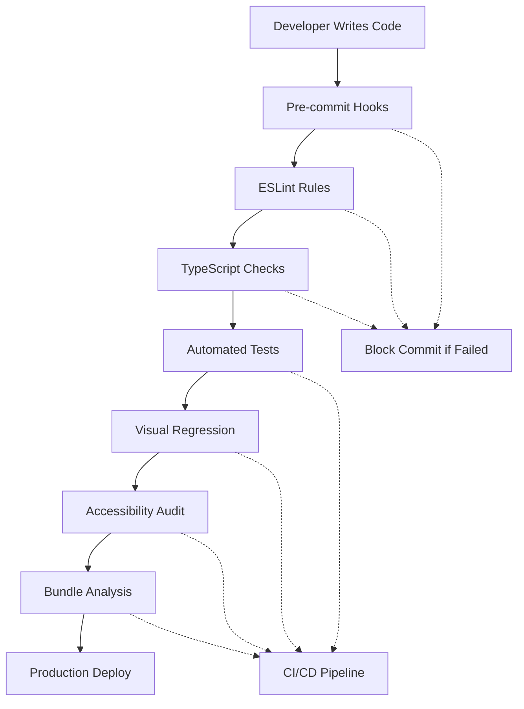

# Design System Validation Rules

This document defines automated validation rules, linting configurations, and compliance checks to ensure consistent atomic design system implementation across the MaterialLab codebase.

## Validation Architecture

### **Validation Layers**



### **Validation Types**

#### **Static Analysis** (Pre-commit)
- ESLint rules for design token usage
- TypeScript type checking for atomic props
- Import/export validation
- File structure compliance

#### **Runtime Validation** (CI/CD)
- Component prop validation
- Theme switching functionality
- Accessibility compliance
- Performance benchmarks

#### **Visual Validation** (Automated)
- Screenshot comparison testing
- Cross-browser rendering
- Theme variant validation
- Responsive design checks

## ESLint Configuration

### **Custom Rules** (`.eslintrc.js`)

```javascript
module.exports = {
  extends: [
    'react-app',
    '@typescript-eslint/recommended'
  ],
  plugins: ['design-system-rules'],
  rules: {
    // === DESIGN TOKEN ENFORCEMENT ===
    'design-system-rules/no-hardcoded-colors': 'error',
    'design-system-rules/no-hardcoded-spacing': 'warn',
    'design-system-rules/require-semantic-tokens': 'error',
    'design-system-rules/no-magic-numbers': 'warn',
    
    // === ATOMIC DESIGN COMPLIANCE ===
    'design-system-rules/atomic-import-restrictions': 'error',
    'design-system-rules/component-naming-convention': 'error',
    'design-system-rules/proper-atomic-nesting': 'error',
    
    // === ACCESSIBILITY REQUIREMENTS ===
    'design-system-rules/require-alt-text': 'error',
    'design-system-rules/proper-heading-structure': 'error',
    'design-system-rules/focus-management': 'warn',
    
    // === PERFORMANCE RULES ===
    'design-system-rules/lazy-load-organisms': 'warn',
    'design-system-rules/optimize-rerenders': 'warn'
  },
  
  // Rule configurations
  settings: {
    'design-system-rules': {
      atomicLevels: {
        atoms: ['Button', 'Input', 'Typography', 'Icon'],
        molecules: ['FormField', 'NavItem', 'SearchBox'],
        organisms: ['Navigation', 'ContactForm', 'Hero']
      },
      tokenPatterns: {
        colors: /var\(--color-[\w-]+\)/,
        spacing: /var\(--spacing-[\w-]+\)/,
        typography: /var\(--text-[\w-]+\)/
      }
    }
  }
};
```

### **Custom ESLint Plugin Implementation**

```javascript
// eslint-plugin-design-system-rules/index.js
module.exports = {
  rules: {
    'no-hardcoded-colors': {
      meta: {
        type: 'problem',
        docs: { description: 'Prevent hardcoded color values' },
        schema: []
      },
      create(context) {
        const colorPatterns = [
          /#[0-9A-Fa-f]{3,8}/,  // Hex colors
          /rgb\([\d\s,]+\)/,     // RGB colors
          /rgba\([\d\s,\.]+\)/,  // RGBA colors
          /hsl\([\d\s,%]+\)/     // HSL colors
        ];
        
        return {
          Literal(node) {
            if (typeof node.value === 'string') {
              colorPatterns.forEach(pattern => {
                if (pattern.test(node.value)) {
                  context.report({
                    node,
                    message: `Hardcoded color "${node.value}" found. Use design tokens instead.`,
                    suggest: [{
                      desc: 'Replace with semantic color token',
                      fix(fixer) {
                        return fixer.replaceText(node, '"var(--color-interactive-primary)"');
                      }
                    }]
                  });
                }
              });
            }
          },
          
          TemplateElement(node) {
            colorPatterns.forEach(pattern => {
              if (pattern.test(node.value.raw)) {
                context.report({
                  node,
                  message: `Hardcoded color found in template. Use design tokens.`
                });
              }
            });
          }
        };
      }
    },
    
    'atomic-import-restrictions': {
      meta: {
        type: 'problem',
        docs: { description: 'Enforce atomic design import hierarchy' }
      },
      create(context) {
        const settings = context.settings['design-system-rules'];
        const { atomicLevels } = settings;
        
        return {
          ImportDeclaration(node) {
            const importPath = node.source.value;
            const currentFile = context.getFilename();
            
            // Atoms cannot import from molecules or organisms
            if (currentFile.includes('/atoms/') || isAtomComponent(currentFile)) {
              if (importPath.includes('/molecules/') || importPath.includes('/organisms/')) {
                context.report({
                  node,
                  message: 'Atoms cannot import from molecules or organisms'
                });
              }
            }
            
            // Molecules cannot import from organisms
            if (currentFile.includes('/molecules/') || isMoleculeComponent(currentFile)) {
              if (importPath.includes('/organisms/')) {
                context.report({
                  node,
                  message: 'Molecules cannot import from organisms'
                });
              }
            }
          }
        };
      }
    }
  }
};
```

## TypeScript Validation

### **Atomic Design Type System**

```typescript
// src/types/atomic-design.ts
export interface AtomicComponent {
  atomicLevel: 'atom' | 'molecule' | 'organism';
  dependencies?: AtomicComponent[];
  themeSupport: boolean;
  accessibilityCompliant: boolean;
}

export interface AtomProps {
  // Atoms can only accept primitive props
  className?: string;
  children?: React.ReactNode;
  theme?: 'humanistic' | 'structured' | 'auto';
  // No complex object props allowed
}

export interface MoleculeProps extends AtomProps {
  // Molecules can accept atom instances
  atoms?: React.ReactElement<AtomProps>[];
}

export interface OrganismProps extends MoleculeProps {
  // Organisms can accept molecules and manage complex state
  molecules?: React.ReactElement<MoleculeProps>[];
  onStateChange?: (state: any) => void;
}
```

### **Component Validation Types**

```typescript
// src/types/component-validation.ts
export interface ComponentValidation {
  name: string;
  atomicLevel: 'atom' | 'molecule' | 'organism';
  tokensUsed: string[];
  hardcodedValues: string[];
  themeVariants: Array<'humanistic-light' | 'humanistic-dark' | 'structured-light' | 'structured-dark'>;
  accessibilityScore: number;
  dependencies: string[];
  violations: ValidationViolation[];
}

export interface ValidationViolation {
  rule: string;
  severity: 'error' | 'warning' | 'info';
  message: string;
  line?: number;
  column?: number;
  suggestion?: string;
}

// Type guards for atomic levels
export const isAtom = (component: any): component is AtomProps => {
  return component.atomicLevel === 'atom';
};

export const isMolecule = (component: any): component is MoleculeProps => {
  return component.atomicLevel === 'molecule';
};

export const isOrganism = (component: any): component is OrganismProps => {
  return component.atomicLevel === 'organism';
};
```

## Pre-commit Hooks

### **Husky Configuration** (`.husky/pre-commit`)

```bash
#!/bin/sh
. "$(dirname "$0")/_/husky.sh"

echo "🚀 Running pre-commit validation..."

# 1. Design Token Validation
echo "🎨 Checking design token usage..."
npm run validate:tokens

# 2. Component Structure Validation  
echo "🧬 Validating atomic design structure..."
npm run validate:atomic

# 3. Accessibility Validation
echo "♿ Running accessibility checks..."
npm run validate:a11y

# 4. Theme Validation
echo "🌓 Validating theme support..."
npm run validate:themes

# 5. Performance Validation
echo "⚡ Checking performance impact..."
npm run validate:performance

echo "✅ Pre-commit validation complete!"
```

### **Package.json Scripts**

```json
{
  "scripts": {
    "validate:tokens": "node scripts/validate-tokens.js",
    "validate:atomic": "node scripts/validate-atomic-structure.js", 
    "validate:a11y": "axe-cli src/**/*.tsx --tags wcag2a,wcag2aa",
    "validate:themes": "node scripts/validate-theme-support.js",
    "validate:performance": "bundlesize",
    "validate:all": "npm run validate:tokens && npm run validate:atomic && npm run validate:a11y && npm run validate:themes"
  }
}
```

## Validation Scripts

### **Token Usage Validator**

```javascript
// scripts/validate-tokens.js
const fs = require('fs');
const path = require('path');

class TokenValidator {
  constructor() {
    this.violations = [];
    this.allowedTokens = this.loadDesignTokens();
  }
  
  loadDesignTokens() {
    const tokensPath = path.join(__dirname, '../design-system/01_tokens.json');
    const tokens = JSON.parse(fs.readFileSync(tokensPath, 'utf-8'));
    return this.flattenTokens(tokens);
  }
  
  validateFile(filePath) {
    const content = fs.readFileSync(filePath, 'utf-8');
    const lines = content.split('\n');
    
    lines.forEach((line, index) => {
      // Check for hardcoded colors
      const colorMatches = line.match(/#[0-9A-Fa-f]{3,8}/g);
      if (colorMatches) {
        this.violations.push({
          file: filePath,
          line: index + 1,
          type: 'hardcoded-color',
          value: colorMatches[0],
          message: `Hardcoded color found: ${colorMatches[0]}. Use design tokens instead.`,
          suggestion: this.suggestColorToken(colorMatches[0])
        });
      }
      
      // Check for hardcoded spacing
      const spacingMatches = line.match(/[0-9]+px(?!\s*;?\s*\/\*\s*allowed)/g);
      if (spacingMatches) {
        this.violations.push({
          file: filePath,
          line: index + 1,
          type: 'hardcoded-spacing',
          value: spacingMatches[0],
          message: `Hardcoded spacing found: ${spacingMatches[0]}. Use spacing tokens.`,
          suggestion: this.suggestSpacingToken(spacingMatches[0])
        });
      }
    });
  }
  
  suggestColorToken(color) {
    const colorMap = {
      '#FFFFFF': 'var(--color-background-primary)',
      '#000000': 'var(--color-text-primary)',
      '#FF6F61': 'var(--color-interactive-primary)',
      '#55C2FF': 'var(--color-interactive-secondary)'
    };
    return colorMap[color.toUpperCase()] || 'var(--color-appropriate-token)';
  }
  
  suggestSpacingToken(spacing) {
    const spacingMap = {
      '4px': 'var(--spacing-1)',
      '8px': 'var(--spacing-2)', 
      '12px': 'var(--spacing-3)',
      '16px': 'var(--spacing-4)',
      '24px': 'var(--spacing-6)',
      '32px': 'var(--spacing-8)'
    };
    return spacingMap[spacing] || 'var(--spacing-appropriate)';
  }
  
  run() {
    const srcDir = path.join(__dirname, '../src');
    this.walkDirectory(srcDir);
    
    if (this.violations.length > 0) {
      console.error('❌ Design token violations found:');
      this.violations.forEach(violation => {
        console.error(`  ${violation.file}:${violation.line} - ${violation.message}`);
        if (violation.suggestion) {
          console.error(`    Suggestion: ${violation.suggestion}`);
        }
      });
      process.exit(1);
    } else {
      console.log('✅ No design token violations found');
    }
  }
  
  walkDirectory(dir) {
    const files = fs.readdirSync(dir);
    files.forEach(file => {
      const filePath = path.join(dir, file);
      const stat = fs.statSync(filePath);
      
      if (stat.isDirectory()) {
        this.walkDirectory(filePath);
      } else if (file.match(/\.(tsx?|jsx?)$/)) {
        this.validateFile(filePath);
      }
    });
  }
}

new TokenValidator().run();
```

### **Atomic Structure Validator**

```javascript
// scripts/validate-atomic-structure.js
const fs = require('fs');
const path = require('path');

class AtomicValidator {
  constructor() {
    this.violations = [];
    this.componentRegistry = this.loadComponentRegistry();
  }
  
  loadComponentRegistry() {
    const registryPath = path.join(__dirname, '../COMPONENT_REGISTRY.md');
    const content = fs.readFileSync(registryPath, 'utf-8');
    return this.parseRegistry(content);
  }
  
  validateComponent(filePath) {
    const content = fs.readFileSync(filePath, 'utf-8');
    const componentName = this.extractComponentName(filePath);
    const registryEntry = this.componentRegistry[componentName];
    
    if (!registryEntry) {
      this.violations.push({
        file: filePath,
        type: 'unregistered-component',
        message: `Component ${componentName} not found in registry`,
        severity: 'warning'
      });
      return;
    }
    
    // Validate atomic level compliance
    this.validateAtomicLevel(filePath, content, registryEntry);
    this.validateDependencies(filePath, content, registryEntry);
    this.validateThemeSupport(filePath, content, registryEntry);
  }
  
  validateAtomicLevel(filePath, content, registryEntry) {
    const { atomicLevel } = registryEntry;
    
    // Atoms should not import molecules or organisms
    if (atomicLevel === 'atom') {
      const moleculeImports = content.match(/import.*from.*molecules/g);
      const organismImports = content.match(/import.*from.*organisms/g);
      
      if (moleculeImports || organismImports) {
        this.violations.push({
          file: filePath,
          type: 'atomic-violation',
          message: 'Atoms cannot import molecules or organisms',
          severity: 'error'
        });
      }
    }
    
    // Molecules should not import organisms  
    if (atomicLevel === 'molecule') {
      const organismImports = content.match(/import.*from.*organisms/g);
      
      if (organismImports) {
        this.violations.push({
          file: filePath,
          type: 'atomic-violation', 
          message: 'Molecules cannot import organisms',
          severity: 'error'
        });
      }
    }
  }
  
  run() {
    const srcDir = path.join(__dirname, '../src/components');
    this.walkDirectory(srcDir);
    
    if (this.violations.length > 0) {
      const errors = this.violations.filter(v => v.severity === 'error');
      const warnings = this.violations.filter(v => v.severity === 'warning');
      
      if (errors.length > 0) {
        console.error('❌ Atomic design violations found:');
        errors.forEach(violation => {
          console.error(`  ${violation.file} - ${violation.message}`);
        });
        process.exit(1);
      }
      
      if (warnings.length > 0) {
        console.warn('⚠️  Atomic design warnings:');
        warnings.forEach(violation => {
          console.warn(`  ${violation.file} - ${violation.message}`);
        });
      }
    } else {
      console.log('✅ Atomic design structure is valid');
    }
  }
}

new AtomicValidator().run();
```

### **Theme Support Validator**

```javascript
// scripts/validate-theme-support.js
const puppeteer = require('puppeteer');

class ThemeValidator {
  async validateThemeSupport() {
    const browser = await puppeteer.launch();
    const page = await browser.newPage();
    
    const themes = [
      'humanistic-light',
      'humanistic-dark', 
      'structured-light',
      'structured-dark'
    ];
    
    const violations = [];
    
    for (const theme of themes) {
      await page.goto('http://localhost:3000');
      await page.evaluate((theme) => {
        document.documentElement.setAttribute('data-theme', theme);
      }, theme);
      
      // Check for broken styling
      const brokenStyles = await page.evaluate(() => {
        const elements = document.querySelectorAll('*');
        const broken = [];
        
        elements.forEach(el => {
          const styles = getComputedStyle(el);
          
          // Check for fallback to initial values (indicates broken tokens)
          if (styles.backgroundColor === 'initial' || 
              styles.color === 'initial' ||
              styles.backgroundColor === 'rgba(0, 0, 0, 0)' && el.tagName !== 'BODY') {
            broken.push({
              selector: el.tagName + (el.className ? `.${el.className}` : ''),
              issue: 'Missing theme support'
            });
          }
        });
        
        return broken;
      });
      
      if (brokenStyles.length > 0) {
        violations.push({
          theme,
          issues: brokenStyles
        });
      }
    }
    
    await browser.close();
    
    if (violations.length > 0) {
      console.error('❌ Theme support violations found:');
      violations.forEach(({ theme, issues }) => {
        console.error(`  Theme: ${theme}`);
        issues.forEach(issue => {
          console.error(`    ${issue.selector}: ${issue.issue}`);
        });
      });
      process.exit(1);
    } else {
      console.log('✅ All themes supported correctly');
    }
  }
}

new ThemeValidator().validateThemeSupport().catch(console.error);
```

## Continuous Integration Validation

### **GitHub Actions Workflow** (`.github/workflows/validation.yml`)

```yaml
name: Design System Validation

on:
  push:
    branches: [main, develop]
  pull_request:
    branches: [main]

jobs:
  validate:
    runs-on: ubuntu-latest
    
    steps:
      - uses: actions/checkout@v3
      
      - name: Setup Node.js
        uses: actions/setup-node@v3
        with:
          node-version: '18'
          cache: 'npm'
          
      - name: Install dependencies
        run: npm ci
        
      - name: TypeScript validation
        run: npm run type-check
        
      - name: ESLint validation  
        run: npm run lint
        
      - name: Design token validation
        run: npm run validate:tokens
        
      - name: Atomic structure validation
        run: npm run validate:atomic
        
      - name: Build application
        run: npm run build
        
      - name: Start dev server
        run: npm run dev &
        
      - name: Wait for server
        run: npx wait-on http://localhost:3000
        
      - name: Theme support validation
        run: npm run validate:themes
        
      - name: Accessibility validation
        run: npm run validate:a11y
        
      - name: Visual regression testing
        run: npm run test:visual
        
      - name: Bundle size check
        run: npm run validate:performance
```

## Component-Level Validation

### **Runtime Prop Validation**

```typescript
// src/utils/component-validator.ts
import PropTypes from 'prop-types';

export const createAtomValidator = (componentName: string) => ({
  // Atoms can only have primitive props
  className: PropTypes.string,
  children: PropTypes.node,
  theme: PropTypes.oneOf(['humanistic', 'structured', 'auto']),
  
  // No complex object props allowed for atoms
  style: (props: any, propName: string) => {
    if (props[propName]) {
      return new Error(`Atom component ${componentName} should not accept style prop. Use design tokens instead.`);
    }
  }
});

export const createMoleculeValidator = (componentName: string) => ({
  ...createAtomValidator(componentName),
  
  // Molecules can accept atom references
  atoms: PropTypes.arrayOf(PropTypes.element),
  
  // Simple state management props
  onChange: PropTypes.func,
  value: PropTypes.any
});

export const createOrganismValidator = (componentName: string) => ({
  ...createMoleculeValidator(componentName),
  
  // Organisms can manage complex state
  onStateChange: PropTypes.func,
  initialState: PropTypes.object,
  
  // Can accept molecules
  molecules: PropTypes.arrayOf(PropTypes.element)
});
```

### **Development Mode Warnings**

```typescript
// src/utils/dev-warnings.ts
export const validateAtomicHierarchy = (
  componentName: string, 
  atomicLevel: 'atom' | 'molecule' | 'organism',
  dependencies: string[]
) => {
  if (process.env.NODE_ENV !== 'development') return;
  
  const violations = [];
  
  switch (atomicLevel) {
    case 'atom':
      const invalidAtomDeps = dependencies.filter(dep => 
        dep.includes('molecule') || dep.includes('organism')
      );
      if (invalidAtomDeps.length > 0) {
        violations.push(`Atom ${componentName} imports invalid dependencies: ${invalidAtomDeps.join(', ')}`);
      }
      break;
      
    case 'molecule': 
      const invalidMoleculeDeps = dependencies.filter(dep => 
        dep.includes('organism')
      );
      if (invalidMoleculeDeps.length > 0) {
        violations.push(`Molecule ${componentName} imports invalid dependencies: ${invalidMoleculeDeps.join(', ')}`);
      }
      break;
  }
  
  if (violations.length > 0) {
    console.warn('⚠️ Atomic Design Violations:', violations);
  }
};
```

## Performance Validation

### **Bundle Size Monitoring**

```javascript
// bundlesize.config.js
module.exports = [
  {
    path: './dist/assets/*.js',
    maxSize: '400kb',
    compression: 'gzip'
  },
  {
    path: './dist/assets/*.css', 
    maxSize: '50kb',
    compression: 'gzip'
  }
];
```

### **Component Performance Tests**

```typescript
// src/tests/performance.test.ts
import { render } from '@testing-library/react';
import { performance } from 'perf_hooks';

describe('Component Performance', () => {
  const performanceThresholds = {
    atom: 5, // 5ms max render time
    molecule: 15, // 15ms max render time  
    organism: 50 // 50ms max render time
  };
  
  test('Button (atom) renders within threshold', () => {
    const start = performance.now();
    render(<Button>Test</Button>);
    const end = performance.now();
    
    expect(end - start).toBeLessThan(performanceThresholds.atom);
  });
});
```

## Accessibility Validation

### **Automated A11Y Testing**

```javascript
// scripts/validate-a11y.js
const { AxePuppeteer } = require('@axe-core/puppeteer');
const puppeteer = require('puppeteer');

class AccessibilityValidator {
  async validatePages() {
    const browser = await puppeteer.launch();
    const page = await browser.newPage();
    
    const pages = [
      '/',
      '/about',
      '/services',
      '/contact',
      '/veo'
    ];
    
    const violations = [];
    
    for (const pagePath of pages) {
      await page.goto(`http://localhost:3000${pagePath}`);
      
      const results = await new AxePuppeteer(page)
        .withTags(['wcag2a', 'wcag2aa'])
        .analyze();
        
      if (results.violations.length > 0) {
        violations.push({
          page: pagePath,
          violations: results.violations
        });
      }
    }
    
    await browser.close();
    
    if (violations.length > 0) {
      console.error('❌ Accessibility violations found:');
      violations.forEach(({ page, violations }) => {
        console.error(`  Page: ${page}`);
        violations.forEach(violation => {
          console.error(`    ${violation.id}: ${violation.description}`);
          console.error(`    Impact: ${violation.impact}`);
          console.error(`    Elements: ${violation.nodes.length}`);
        });
      });
      process.exit(1);
    } else {
      console.log('✅ All accessibility checks passed');
    }
  }
}

new AccessibilityValidator().validatePages().catch(console.error);
```

## Success Metrics & Reporting

### **Validation Dashboard**

```typescript
// scripts/generate-validation-report.js
const generateValidationReport = () => {
  const report = {
    timestamp: new Date().toISOString(),
    scores: {
      tokenCompliance: calculateTokenCompliance(),
      atomicStructure: calculateAtomicCompliance(), 
      themeSupport: calculateThemeSupport(),
      accessibility: calculateA11yScore(),
      performance: calculatePerformanceScore()
    },
    violations: collectAllViolations(),
    improvements: suggestImprovements()
  };
  
  // Generate HTML report
  const html = generateHTMLReport(report);
  fs.writeFileSync('validation-report.html', html);
  
  // Generate JSON for CI/CD
  fs.writeFileSync('validation-report.json', JSON.stringify(report, null, 2));
  
  console.log('📊 Validation report generated');
  console.log(`Overall Score: ${calculateOverallScore(report.scores)}/100`);
};
```

### **Validation Metrics**

```typescript
interface ValidationMetrics {
  tokenCompliance: number;      // % of components using only tokens
  atomicStructure: number;      // % of components following atomic rules
  themeSupport: number;         // % of components supporting all themes
  accessibility: number;        // WCAG compliance score
  performance: number;          // Bundle size and render time score
  overall: number;              // Weighted average of all scores
}

const targetMetrics: ValidationMetrics = {
  tokenCompliance: 100,         // 100% token usage required
  atomicStructure: 100,         // 100% atomic compliance required
  themeSupport: 100,            // 100% theme support required  
  accessibility: 95,            // 95% WCAG compliance target
  performance: 90,              // 90% performance score target
  overall: 97                   // 97% overall score target
};
```

---

**Validation Rules Version:** 1.0.0  
**Last Updated:** January 2025  
**Next Review:** After validation system implementation