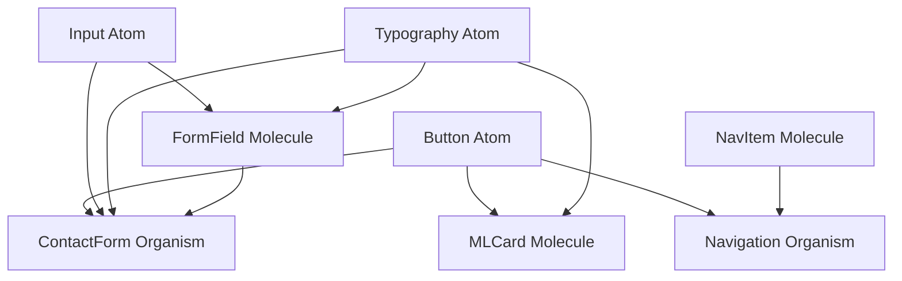

# Component Registry

This registry maps all components in the MaterialLab project to their atomic design levels and tracks their current status, dependencies, and migration needs.

## Registry Overview

| Component | Atomic Level | Status | Location | Tokens Used | Dependencies | Migration Needed |
|-----------|--------------|--------|----------|-------------|--------------|------------------|
| **Button** | Atom | ✅ Unified | `src/components/UI/Button.tsx` | ✅ | None | No |
| **Input** | Atom | ✅ Unified | `src/components/UI/Input.tsx` | ✅ | None | No |
| **Typography** | Atom | ✅ Good | `src/components/ML/Typography.tsx` | ✅ | None | Minor |
| **MLCard** | Molecule | ⚠️ Needs Review | `src/components/ML/Card.tsx` | ✅ | Button, Typography | Yes |
| **Navigation** | Organism | ⚠️ Mixed Styles | `src/components/Navigation/Navigation.tsx` | ⚠️ Partial | Button, Typography | Yes |
| **ContactForm** | Organism | ❌ Legacy | `src/components/ContactForm/ContactForm.tsx` | ❌ | Input, Button | Yes |
| **VeoHero** | Organism | ⚠️ Standalone | `src/components/VeoHero.tsx` | ⚠️ Partial | Button, Typography | Yes |

## Atomic Level Definitions

### 🔴 **Atoms** - Irreducible UI Elements
Single-purpose components that cannot be broken down further without losing functionality.

#### Current Atoms
- **Button** ✅ - Interactive element for actions
  - Location: `src/components/UI/Button.tsx`
  - Variants: primary, secondary, tertiary, destructive
  - Status: Well-structured, uses design tokens
  
- **Input** ✅ - Form input fields
  - Location: `src/components/UI/Input.tsx`
  - Types: text, email, password, textarea, select
  - Status: Well-structured, uses design tokens
  
- **Typography Components** ✅ - Text elements
  - Location: `src/components/ML/Typography.tsx`
  - Components: MLText, MLHeading, MLBody, MLCaption
  - Status: Good structure, minor token updates needed

#### Missing Atoms (Need Creation)
- **Icon** - SVG icon components
- **Avatar** - User profile images
- **Badge** - Status indicators
- **Spinner** - Loading indicators
- **Checkbox** - Boolean input controls
- **Radio** - Single selection controls
- **Switch** - Toggle controls
- **Slider** - Range input controls

### 🟡 **Molecules** - Functional Component Groups
Combinations of atoms that work together for specific functionality.

#### Current Molecules
- **MLCard** ⚠️ - Content container
  - Location: `src/components/ML/Card.tsx`
  - Dependencies: Button, Typography atoms
  - Issues: Mixed with organisms, needs refactoring
  
- **FormField** ❌ - Input with label and validation
  - Status: Missing - needs creation
  - Dependencies: Input, Typography atoms
  
- **SearchBox** ❌ - Search input with icon
  - Status: Missing - needs creation
  - Dependencies: Input, Icon atoms
  
- **NavItem** ❌ - Individual navigation element
  - Status: Missing - extracted from Navigation organism
  - Dependencies: Button, Icon atoms

#### Molecules Needing Creation
- **FormField** - Input + Label + Error message
- **SearchBox** - Input + Search icon + Clear button
- **NavItem** - Link + Icon + Badge (if needed)
- **MediaCard** - Image + Title + Description
- **StatusMessage** - Icon + Text for errors/success
- **ProgressBar** - Progress indicator with labels

### 🟢 **Organisms** - Complete Functional Sections
Complex components that provide complete user functionality.

#### Current Organisms
- **Navigation** ⚠️ - Site navigation
  - Location: `src/components/Navigation/Navigation.tsx`
  - Dependencies: NavItem molecules, Button atoms
  - Issues: Mixed Veo/ML styles, needs molecular breakdown
  
- **ContactForm** ❌ - Complete contact form
  - Location: `src/components/ContactForm/ContactForm.tsx`
  - Dependencies: FormField molecules, Button atoms
  - Issues: Uses legacy patterns, no design tokens
  
- **VeoHero** ⚠️ - Hero section
  - Location: `src/components/VeoHero.tsx`
  - Dependencies: Button atoms, Typography atoms
  - Issues: Standalone component, needs integration

#### Organisms Needing Attention
- **Header** - Site header with navigation and actions
- **Footer** - Site footer with links and information
- **ServiceGrid** - Grid of service offerings
- **ContactSection** - Contact form with surrounding content
- **TestimonialSection** - Customer testimonials display

## Design System Compliance Status

### ✅ **Compliant Components**
- `UI/Button.tsx` - Properly uses design tokens
- `UI/Input.tsx` - Follows atomic principles
- `ML/Typography.tsx` - Good token usage

### ⚠️ **Partially Compliant**
- `ML/Card.tsx` - Uses tokens but mixing levels
- `Navigation/Navigation.tsx` - Mixed styling approaches
- `VeoHero.tsx` - Partial token usage

### ❌ **Non-Compliant**
- `ContactForm/ContactForm.tsx` - No design tokens
- `ServiceCards/ServiceCards.tsx` - Legacy implementation
- `MediaPlaceholder/MediaPlaceholder.tsx` - Hardcoded styles

## Token Usage Analysis

### Components Using Design Tokens ✅
```typescript
// Good example from UI/Button.tsx
const StyledButton = styled.button`
  background-color: var(--color-background-interactive-primary);
  color: var(--color-text-on-interactive);
  padding: ${tokens.spacing['3']} ${tokens.spacing['6']};
`
```

### Components Needing Token Migration ❌
```typescript
// Bad example - hardcoded values
const OldCard = styled.div`
  background: #FFFFFF;
  color: #333333;
  padding: 16px 24px;
  border-radius: 8px;
`
```

## Migration Priority Matrix

### **High Priority** (Impact: High, Effort: Medium)
1. **ContactForm** - Core user journey, legacy code
2. **Navigation** - Site-wide component, mixed styles
3. **ServiceCards** - Key conversion component

### **Medium Priority** (Impact: Medium, Effort: Low)
1. **MLCard** - Widely used, needs level separation
2. **VeoHero** - Important but contained
3. **MediaPlaceholder** - Simple token updates

### **Low Priority** (Impact: Low, Effort: High)
1. **ProofStrip** - Minor component
2. **FeatureDiscovery** - Specialized use case
3. **AudienceSelector** - Limited usage

## Dependency Graph



## Theme Support Status

### **Light Theme Support**
- ✅ Button, Input, Typography
- ⚠️ MLCard (partial)
- ❌ ContactForm, Navigation

### **Dark Theme Support**
- ✅ Button, Input
- ⚠️ Typography (needs testing)
- ❌ Most organisms

## Component Creation Checklist

When creating new components, ensure they meet these criteria:

### **For All Components**
- [ ] Uses only design tokens (no hardcoded values)
- [ ] TypeScript interfaces with proper typing
- [ ] Supports both light and dark themes
- [ ] Includes proper accessibility attributes
- [ ] Has Storybook documentation
- [ ] Includes unit tests

### **For Atoms**
- [ ] Single responsibility principle
- [ ] No dependencies on other custom components
- [ ] Configurable through props only
- [ ] All visual states defined (hover, focus, disabled, etc.)

### **For Molecules**
- [ ] Clear relationship between constituent atoms
- [ ] Manages internal state appropriately
- [ ] Provides clear API for external control
- [ ] Handles error and loading states

### **For Organisms**
- [ ] Accomplishes complete user task
- [ ] Responsive design implemented
- [ ] Proper error boundaries
- [ ] Performance optimized (lazy loading, memoization)

## Updates and Maintenance

### **Weekly Reviews**
- [ ] Check new component submissions against atomic levels
- [ ] Validate token usage in recent changes
- [ ] Update registry for any structural changes

### **Monthly Audits**
- [ ] Review migration progress
- [ ] Update dependency relationships
- [ ] Check theme support completeness
- [ ] Performance and accessibility audits

### **Quarterly Planning**
- [ ] Plan major component refactoring
- [ ] Update atomic design strategy
- [ ] Review and update registry structure
- [ ] Plan new component development

---

**Last Updated:** January 2025  
**Registry Version:** 1.0.0  
**Next Review:** End of January 2025